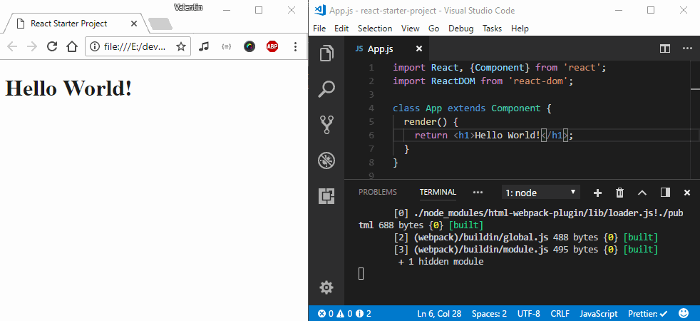
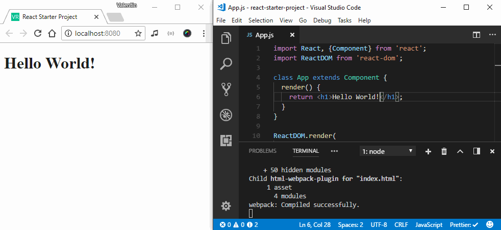

# How to roll your own React, Babel and Webpack boilerplate
# Setup a React Environment Using webpack and Babel

The complexity of building even the simplest "Hello World" app with React used to be a constant source of frustration for developers. Luckily [someone eventually listened](https://reactjs.org/blog/2016/07/22/create-apps-with-no-configuration.html) and gave us an alternative: [`create-react-app`](https://github.com/facebookincubator/create-react-app).
If you just need to get up and running quickly without any headaches then this is the tool for you.

There are a few caveats though. One of them is that no matter how well this tool is put together it can never hope to cover every possible use case out there.  
If you're big into preprocessors like SASS or LESS, well, they're not supported out of the box and the [provided alternative](https://github.com/facebookincubator/create-react-app/blob/master/packages/react-scripts/template/README.md#adding-a-css-preprocessor-sass-less-etc) doesn't play to the strengths of Webpack.

Let's take this scenario and roll with it. We're DIY developers that love getting their hands dirty, we want to build something with React and SASS so we'll set up a super barebones way to:

1. Build a bundle for a React component with SASS styles
1. Make sure our JSX and ES6+ code gets compiled to ES5 so it runs in any browser
1. Allow us to locally preview changes through hot reloading
1. Be ready to deploy to Heroku

> Note: This article tries to cover the basics of setting up a React + Webpack project. If this is your first time, then you're in the right place. If you've done this before there may still be something you can learn from it, just don't expect all the intricate details to be covered.

## Building a React Bundle

Let's create a folder to house our future app and initialize with a `package.json` file. We'll also add React since we know we're going to need it later.

```sh
mkdir react-boilerplate
cd react-boilerplate

# this will ask you a bunch of questions
# enter as much or as little info as you want
npm init

npm install react
npm install react-dom
```

We'll also need some sort of component, let's add it in `src/App.js`.

```jsx
/* src/App.js */
import React, {Component} from 'react';
import ReactDOM from 'react-dom';

class App extends Component {
  render() {
    return <h1>Hello World!</h1>;
  }
}

ReactDOM.render(
  <App />, 
  document.getElementById('root')
);
```

Pretty simple but sadly our component is just a bunch of text at the moment. If we run it through Node (or Chrome) it won't know what `import` is referring nor can it understand JSX syntax.

This is where a tool like [Webpack](https://webpack.js.org/) comes in. It can combine all our source files into a single bundle that can be loaded in a browser.  
More importantly, if we point it at a root component it will in turn build an internal dependency graph. Every `import` in our code will be mapped to either an `npm` package or another asset in our project (component, library, image, etc). And we can use *loaders* Webpack can parse additional syntax types like JSX or SASS.

Let's install Webpack and give it a simple config.

```sh
npm install webpack
touch webpack.config.js
```

```js
/* webpack.config.js */
const path = require('path');

module.exports = {
  // Tell webpack to begin building its 
  // dependency graph from this file.
  entry: path.join(__dirname, 'src', 'App.js'),
  // And to place the output in the `build` directory
  output: {
    path: path.join(__dirname, 'build'),
    filename: 'bundle.js'
  }
}
```
Cool, now our imports will work beautifully but we still need to figure out a way to parse JSX. For this we need [Babel](https://babeljs.io/), let's add it to our project.

```sh
# base of the Babel ecosystem, parses JS code,
# very powerful with the right plugins
npm install babel-core

# allows Webpack to transpile JS code via Babel
npm install babel-loader

# allows transpilation from latest ES2015+ 
# features to ES5
npm install babel-preset-env

# and finally, JSX to ES5 transpilation
npm install babel-preset-react
``` 

Now we can update our `webpack.config.js` with a `module` field. This tells Webpack that any files with the `js` or `jsx` extensions should be parsed with Babel.  
Pay very close attention to the `exclude` option, any npm package imported from `node_modules` will be left as-is. This is generally ok since most packages are already pre-transpiled.

```js
/* webpack.config.js */
module.exports = {
  /* ... */
  module: {
    rules: [
      {
        test: /\.jsx?$/,
        exclude: /node_modules/,
        use: 'babel-loader'
      }
    ]
  }
```

The last part of setting up Babel is telling it to use the presets we installed earlier. All you need to do is add a `babel` field to your `package.json`.

```js
"babel": {
  "presets": [
    "env",
    "react"
  ]
}
```

Now that that's done we can finally compile our code into a bundle. To do this you can run Webpack from the `node_modules` directory `./node_modules/.bin/webpack` but that's a bit of a pain to type out and we'll be running it **a lot**.
So instead we're going to add a shortcut for it in `package.json` under `scripts`.

```js
"scripts": {
  "start": "webpack"
}
```

All that's left to do is run `npm run start` or even better `npm start` and voilà a success message and the compiled bundle can be found `build/bundle.js`. 

```sh
Hash: b5a8448c403cf555a5de
Version: webpack 3.8.1
Time: 1033ms
    Asset    Size  Chunks                    Chunk Names
bundle.js  729 kB       0  [emitted]  [big]  main
  [14] ./src/App.js 2.31 kB {0} [built]
    + 26 hidden modules
```

The bundle is ready and it can be loaded in a browser. We could load it manually but let's get Webpack to help us out instead. Every time we build a bundle we'll also output an HTML file that loads it. 

First let's add a basic template in `public/index.html`.

```html
<!-- public/index.html -->
<!DOCTYPE html>
<html lang="en">

<head>
  <meta charset="UTF-8">
  <meta name="viewport" content="width=device-width, initial-scale=1.0">
  <meta http-equiv="X-UA-Compatible" content="ie=edge">
  <title>React Starter Project</title>
</head>

<body>
  <div id="root"></div>
</body>

</html>
```

Next we'll add and configure a plugin that loads this template and outputs it a build time.

```sh
npm install html-webpack-plugin
```

```js
/* webpack.config.js */
/* ... */
const HtmlWebpackPlugin = require('html-webpack-plugin');

module.exports = {
  /* ... */
  plugins: [
    new HtmlWebpackPlugin({
      template: path.join(__dirname, 'public', 'index.html')
    })
  ]
}
```

Perfect! Now you can start a new build with `npm start` and should see an `index.html` file in your build directory.  

If you inspect it you'll notice that it loads `bundle.js` even though we didn't have any `<script>` tags in our template; `html-webpack-plugin` knows to include it by default. Even better, other plugins can interact with it to also load our styles for example.

## Adding hot reload

We've set up a way to bundle a bunch of scripts and load them in a webpage. It's not bad but it also doesn't set the world on fire. Also it's kind of a pain to manually run the build command every time we make a change.

An easy fix for this is to tell Webpack to continue running in watch mode after building our bundle. Just pass `--watch` when calling webpack. Now after every change to our code the bundle will be rebuilt and we can refresh the page to see the changes.

```sh
./node_modules/.bin/webpack

# Don't mind the first -- it's just a way to pass arguments to 
# scripts from package.json 
npm start -- --watch
```



Not bad. We can can make this whole process even smoother by having the page reload itself. So instead of watch let's use [`webpack-dev-server`](https://webpack.js.org/configuration/dev-server/).

```sh
npm install webpack-dev-server
```

Let's change the start script so that it calls the dev server. It will now be the server's responsibility to manage webpack and load our app.

```js
"scripts": {
  "start": "webpack-dev-server --inline --hot"
}
```

Now every time we make a change `webpack-dev-server` will notify the running app that is needs to update. We're going to do a full reload when this happens.

```js
/* src/App.js */
if (module.hot) {
  module.hot.accept();
}
```

> For bonus points you can add [`react-hot-loader`](https://github.com/gaearon/react-hot-loader) and it will patch only the parts that change. You components can preserve their state between updates!

Time to fire it up and witness the magic at [`http://localhost:8080/`](http://localhost:8080/) 👌




## Styles and assets

We've made good progress so far, in the current state someone could build a decent app by just crafting a few components and integrating a database service like [Firebase](https://firebase.google.com/). Let's give them the power to make their app shine!

Webpack has been a good friend so far so, of course we'll be using it to load our styles as well. Let's first add the SASS compiler and a couple of loaders.

```sh
# creates style tags from JS strings
npm install style-loader 

# translates CSS into JS strings
npm install css-loader

# translates SASS into CSS
npm install sass-loader

# SASS compiler used by the loader above
npm install node-sass
```

As you can see multiple loaders are required here and it's actually kind of awesome that you can chain them together to create a style pipeline. To do this, just add the following rule to `webpack.config.js`.

```sh
{
  test: /\.scss$/,
  use: ['style-loader', 'css-loader', 'sass-loader']
}
```

Now we can begin adding our styles so create an `App.scss` file in `/src`.

```scss

```

For the styles to take effect, We'll also need to import our SASS in `App.js`

```jsx
import './App.scss';
````

```sh
npm install normalize.css
```

```js
/* webpack.config.js */
module.exports = {
  /* ... */
  devServer: {
    /* Tell the server where to serve static content from. 
       We'll need this later on when adding assets. */
    contentBase: path.join(__dirname, 'build')
  }
}
```

## Linting

## Tests

## Ship it!