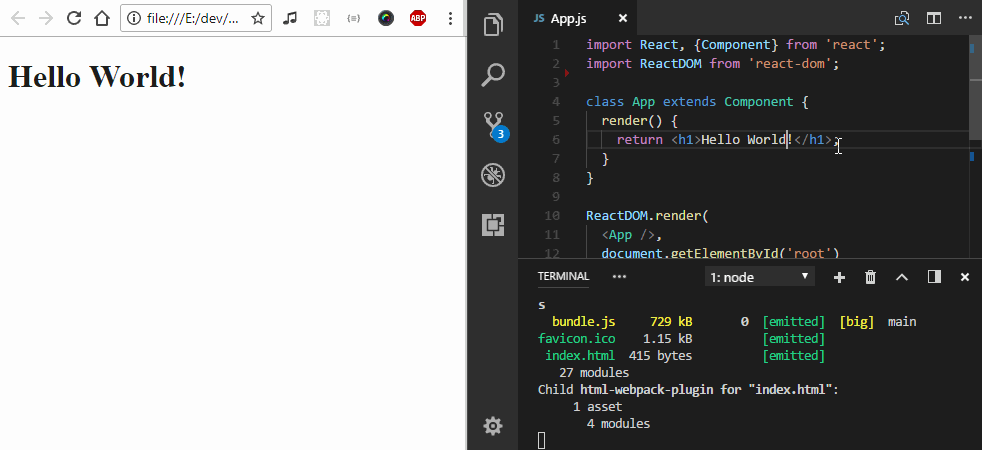
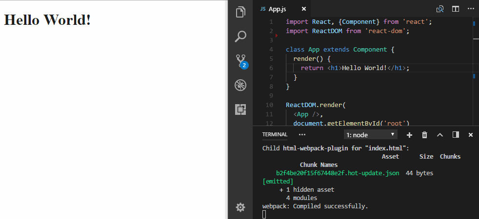
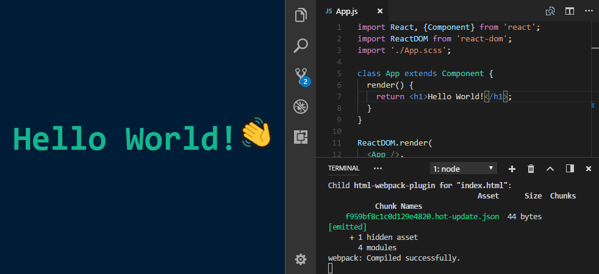

React has become an industry standard at this point, it's the first JavaScript framework that a lot of new developers will learn and the default option for many other experienced ones. 

It's also easy to get familiar with. A vibrant community has produced tons of material on how to get up and running. Beginners can write and display their first component within minutes by using a tool like [CodeSandbox](https://codesandbox.io/).

In this article we'll take a look at the next step in the process: **local development**. We'll take a stab at building our own React development environment and by the end we should have a setup that:

1. Compiles JSX into a JS, Sass into CSS and include both in a bundle.
2. Makes sure our code runs in any modern browser.
3. Allows us to locally preview changes through hot reloading.
4. Is ready to deploy with [Surge](http://surge.sh/).

> If you want to follow along, all the code presented here can be found at [github.com/RadValentin/tiny-react-env](https://github.com/RadValentin/tiny-react-env)

## Creating a React Bundle

Let's create a folder to house our future project and initialize with a `package.json` file. We'll also add React since we know we're going to need it later.

```sh
mkdir tiny-react-env
cd tiny-react-env

# this will ask you a bunch of questions
# enter as much or as little info as you want
npm init

npm install --save react
npm install --save react-dom
```

We'll also need some sort of component, let's add it in `src/components/App.js`.

```jsx
/* src/App.js */
import React, {Component} from 'react';
import ReactDOM from 'react-dom';

class App extends Component {
  render() {
    return <h1>Hello World!</h1>;
  }
}

ReactDOM.render(
  <App />, 
  document.getElementById('root')
);
```

Our component is just a bunch of text at the moment. If we run it through Node (or Chrome) it won't know what `import` is referring to nor can it understand JSX syntax.

This is where a tool like [Webpack](https://webpack.js.org/) comes in. It can combine all our source files into a single bundle that can be loaded in a browser.  
More importantly, if we point it at a root component it will in turn build an internal dependency graph. Every `import` in our code will be mapped to either an `npm` package or another asset in our project (component, library, image, etc). And we can use _loaders_ Webpack can parse additional syntax types like JSX or Sass.

Let's install Webpack and give it a simple config.

```sh
npm install --save webpack
touch webpack.config.js
```

```js
/* webpack.config.js */
const path = require('path');

module.exports = {
  // Tell webpack to begin building its 
  // dependency graph from this file.
  entry: path.join(__dirname, 'src', 'components', 'App.js'),
  // And to place the output in the `build` directory
  output: {
    path: path.join(__dirname, 'build'),
    filename: 'bundle.js'
  }
}
```

Cool, now our imports will work beautifully but we still need to figure out a way to parse JSX. For this we need [Babel](https://babeljs.io/), let's add it to our project.

```sh
# base of the Babel ecosystem, parses JS code,
# very powerful with the right plugins
npm install --save babel-core

# allows Webpack to transpile JS code via Babel
npm install --save babel-loader

# allows transpilation from latest ES2015+ 
# features to ES5
npm install --save babel-preset-env

# and finally, JSX to ES5 transpilation
npm install --save babel-preset-react
```

Now we can update our `webpack.config.js` with a `module` field. This tells Webpack that any files with the `js` or `jsx` extensions should be parsed with Babel.

```js
/* webpack.config.js */
module.exports = {
  /* ... */
  module: {
    rules: [
      {
        test: /\.jsx?$/,
        /* We'll leave npm packages as-is and not 
           parse them with Babel since most of them 
           are already pre-transpiled anyway. */
        exclude: /node_modules/,
        use: 'babel-loader'
      }
    ]
  }
}
```

The last part of setting up Babel is telling it to use the presets we installed earlier. All you need to do is add a `babel` field to your `package.json`.

```js
"babel": {
  "presets": [
    "env",
    "react"
  ]
}
```

Now that that's done we can finally compile our code into a bundle. To do this you could run Webpack from the `node_modules` directory `./node_modules/.bin/webpack` but that's a bit of a pain to type out and we'll be running it **a lot**. Instead we're going to add a shortcut for it in `package.json` under `scripts`.

```js
"scripts": {
  "start": "webpack"
}
```

All that's left to do is run `npm run start` or even better `npm start` and voilà a success message and the compiled bundle can be found `build/bundle.js`. 

```sh
Hash: b5a8448c403cf555a5de
Version: webpack 3.8.1
Time: 1033ms
    Asset    Size  Chunks                    Chunk Names
bundle.js  729 kB       0  [emitted]  [big]  main
  [14] ./src/App.js 2.31 kB {0} [built]
    + 26 hidden modules
```

Open this file to see that it contains all dependencies that were imported (React and ReactDOM) as well as the source code for `App.js`... except it looks a lot different!

While a bit unsightly this is actually the result we want. As promised, Babel turned our fancy ES2015+ class into an old school constructor function and JSX tags got replaced with calls to React [`createElement`](https://reactjs.org/docs/react-api.html#creating-react-elements). Our code will now run in any modern browser.

```js
var App = function (_Component) {
  _inherits(App, _Component);

  function App() {
    _classCallCheck(this, App);

    return _possibleConstructorReturn(this, (App.__proto__ || Object.getPrototypeOf(App)).apply(this, arguments));
  }

  _createClass(App, [{
    key: 'render',
    value: function render() {
      return _react2.default.createElement(
        'h1',
        null,
        'Hello World!'
      );
    }
  }]);

  return App;
}(_react.Component);
```

The next step is to run our code in a browser. On every build we'll create a HTML file from a template and automatically add the relevant `<script>` tag pointing to the new bundle.

First let's add a basic template in `public/index.html`.

```html
<!-- public/index.html -->
<!DOCTYPE html>
<html lang="en">

<head>
  <meta charset="UTF-8">
  <meta name="viewport" content="width=device-width, initial-scale=1.0">
  <meta http-equiv="X-UA-Compatible" content="ie=edge">
  <title>Tiny React Environment Tutorial</title>
</head>

<body>
  <div id="root"></div>
</body>

</html>
```

Next we'll add and configure a plugin that loads this template and outputs it at build time.

```sh
npm install --save html-webpack-plugin
```

```js
/* webpack.config.js */
const HtmlWebpackPlugin = require('html-webpack-plugin');

module.exports = {
  /* ... */
  plugins: [
    new HtmlWebpackPlugin({
      template: path.join(__dirname, 'public', 'index.html')
    })
  ]
}
```

Perfect! Now you can start a new build with `npm start` and you should see an `index.html` file in your build directory. Open it and enjoy the fruits of your labor. 

If you inspect it you'll notice that it loads `bundle.js` even though we didn't have any `<script>` tags in our template - `html-webpack-plugin` did it for us, what a nice fellow!

## Adding hot reload

We've set up a way to bundle a bunch of scripts and load them in a webpage. It's not bad but it also doesn't set the world on fire. Also it's kind of a pain to manually run the build command every time we make a change.

An easy fix for this is to tell Webpack to continue running in watch mode after finishing the build (pass `--watch` when calling it). Now after every change to our code the bundle will be rebuilt and we can refresh the page to see the changes.

```sh
./node_modules/.bin/webpack --watch

# Don't mind the first -- it's just a way to pass arguments to 
# scripts from package.json 
npm start -- --watch
```



Not bad. We can can make this whole process even smoother by having the page reload itself. So instead of watch let's use [`webpack-dev-server`](https://webpack.js.org/configuration/dev-server/).

```sh
npm install --save webpack-dev-server
```

Let's change the start script so that it calls the dev server. It will now be the server's responsibility to manage webpack and load our app.

```js
"scripts": {
  "start": "webpack-dev-server --inline --hot"
}
```

Now every time we make a change `webpack-dev-server` will notify the running app that is needs to update. We're going to do a full reload when this happens.

```js
/* src/App.js */
if (module.hot) {
  module.hot.accept();
}
```

Time to fire it up and witness the magic at [`http://localhost:8080/`](http://localhost:8080/) 👌



> For bonus points you can make this process even smoother by using [`react-hot-loader`](https://github.com/gaearon/react-hot-loader). Instead of a full reload it will patch only the parts that change. You components will preserve their state between updates!

## Adding styles and assets to our bundle

We've made good progress so far, in the current state someone could build a decent app by just crafting a few components and integrating a database service like [Firebase](https://firebase.google.com/). Let's give them the power to make their app shine!

Webpack has been a good friend so far so, of course we'll be using it to load our styles as well. Let's first add the Sass compiler and a couple of loaders.

```sh
# creates style tags from JS strings
npm install --save style-loader 

# translates CSS into JS strings
npm install --save css-loader

# translates Sass into CSS
npm install --save sass-loader

# Sass compiler used by the loader above
npm install --save node-sass
```

As you can see multiple loaders are required here and it's actually kind of awesome that you can chain them together to create a style pipeline. To do this, just add the following rule to `webpack.config.js`.

```sh
{
  test: /\.scss$/,
  use: ['style-loader', 'css-loader', 'sass-loader']
}
```

Now we can begin adding our styles. Create an `App.scss` file in `src/components/` and add some styles that will take advantage of the power that Sass provides.

```scss
$navy: #001e38;
$green: #15b78f;

html {
  background-color: $navy;
}

body {
  margin: 0;
  width: 100vw;
  height: 100vh;
  display: flex;
  justify-content: center;
  align-items: center;
  font-family: monospace;
}

h1 {
  color: $green;
  font-weight: bold;
  font-size: 3.5rem;

  &:after {
    content: '👋';
    display: inline-block;
    transform: rotate(-20deg);
    animation: wave .75s infinite linear alternate;
  }
}

@keyframes wave {
  100% {
    transform: rotate(20deg);
  }
}
```

In order for them to take effect we'll need to import new newly created styles in `App.js`.

```jsx
import './App.scss';
```

Our Style Pipeline™ should be working nicely now. Even better, there's no need to worry about `module.hot` for styles because [`style-loader`](https://github.com/webpack-contrib/style-loader) supports Hot Module Replacement out of the box. So cool!



That hand emoji is nice but it might look a bit different when viewed on another OS. Consistency is key so we'll substitute it for an image (and learn how to load assets in the process).

We don't have any loaders for image assets so let's install some.

    # adds an asset to the output directory
    npm install --save file-loader

    # loads small assets as dataURIs
    # large assets get handled by file-loader
    npm install --save url-loader

These two loaders serve the same purpose, they allow us to reference an asset in our code and add it to the bundle. As the name implies `file-loader` loads assets as files and `url-loader` tries to inline them as [dataURIs](https://developer.mozilla.org/en-US/docs/Web/HTTP/Basics_of_HTTP/Data_URIs).

The reason we use both instead of just relying on `file-loader` is to save on HTTP requests. We inline small assets (under 10kb) so they'll be included in our bundle without dramatically increasing its size.

```js
/* webpack.config.js */
module.exports = {
  /* ... */
  module: {
    rules: [
      /* ... */
      {
        test: /\.(jpe?g|png|gif)$/,
        use: [{
          /* inline if smaller than 10kb, otherwise load as a file */
          loader: 'url-loader',
          options: {
            limit: 10000
          }
        }]
      },
      { 
        test: /\.(eot|svg|ttf|woff2?|otf)$/,
        use: 'file-loader'
      }
    ]
  }
};
```

If we add an image in `src/assets` it should now be possible to reference it in `App.scss`...

```scss
h1 {
  &:after {
    content: '';
    display: inline-block;
    width: 1em;
    height: 1em;
    background: url('../assets/waving-hand-sign.png')
                center/100%
                no-repeat;
}
```

...or in `App.js`.

```jsx
import handWave from '../assets/waving-hand-sign.png';

class App extends Component {
  render() {
    return <h1>
      Hello World!
      
    </h1>;
  }
}
```

## Ship it!

The last thing we'll do today is to deploy our app. Surge makes this process super easy so let's add it to our project.

    npm install --save surge

All that's left is to add a script to our `package.json` that will build the bundle and call the Surge CLI to upload it.

```js
"scripts": {
  "deploy": "webpack && surge -p ./build/ -d tiny-react-env.surge.sh"
}
```

Wohoo we're now up and running at <http://tiny-react-env.surge.sh/>. Good job!

## What's next?

It wasn't easy but we've managed to set up a workspace for our future project. Let's do a quick recap:

- Our code is transpiled with Babel and we can use the latest ES2015+ features.
- We use Webpack to build our bundle and Webpack Dev Server to develop locally with hot reloading.
- We have a style pipeline that compiles our Sass code and we're also bundling our assets.

This is just the tip of the iceberg though, there're a lot more you can do to expand this setup. Here are some ideas for what to try next:

1. Enable source maps by setting a [`devtool`](https://webpack.js.org/configuration/devtool/) field in the webpack config.
2. Create a separate **production** config to be used when deploying, disable source maps for it and minify the bundle with [`babel-minify-webpack-plugin`](https://webpack.js.org/plugins/babel-minify-webpack-plugin/).
3. Use [`extract-text-webpack-plugin`](https://github.com/webpack-contrib/extract-text-webpack-plugin) to output your style bundle as a separate file from the js bundle.

Good luck!

> This article was originally published on [Codementor](https://www.codementor.io/valentinrad/roll-your-own-tiny-react-environment-using-webpack-babel-and-sass-ei70wyhjl).
